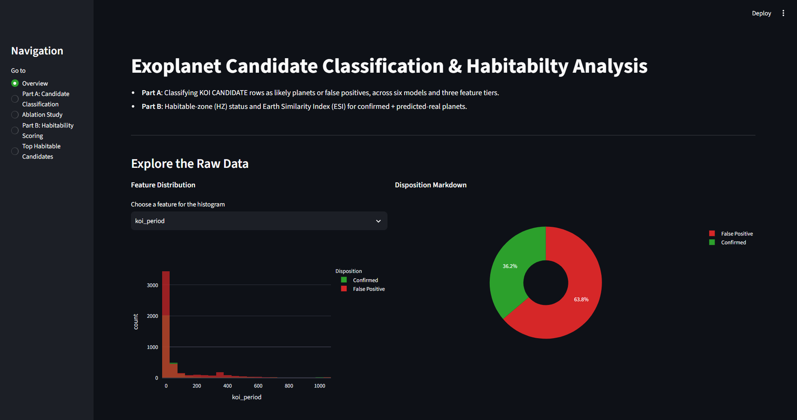
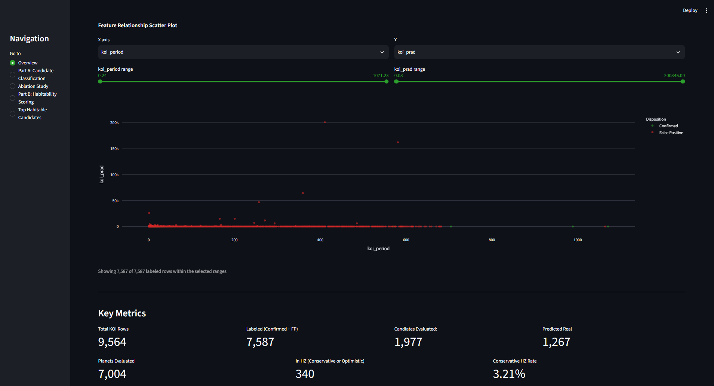
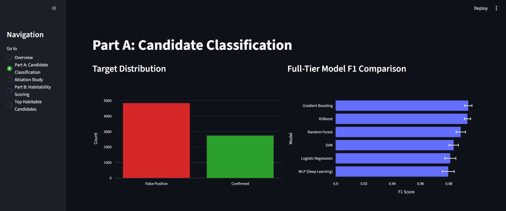
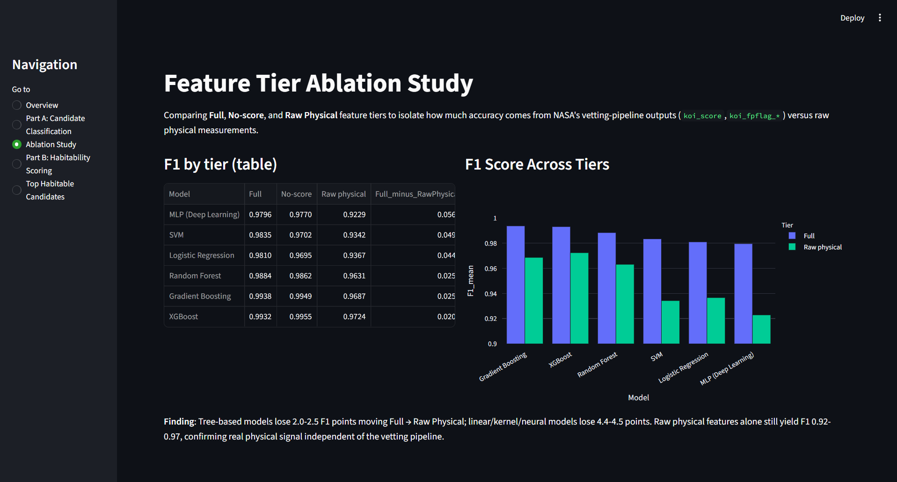
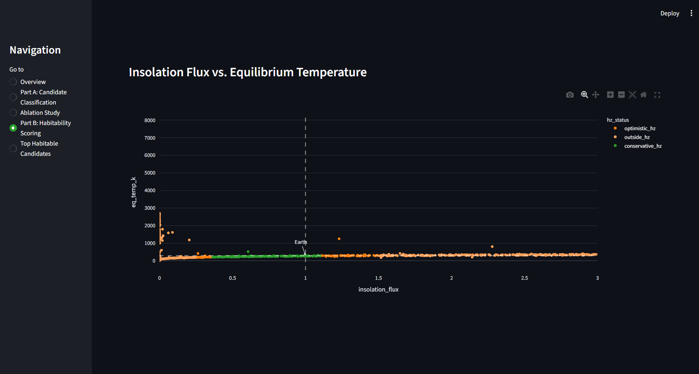
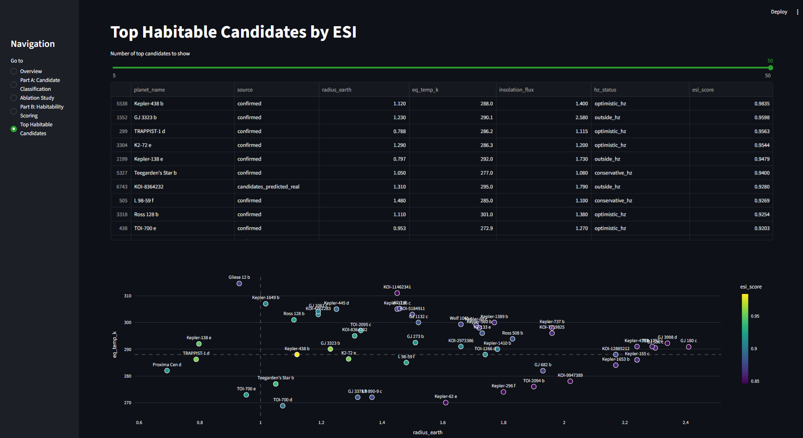

# Exoplanet Candidate Classification & Habitability Analysis

A two-part machine learning project built on NASA's Kepler and Exoplanet Archive data:

- **Part A** - Classifying Kepler Objects of Interest (KOI) `CANDIDATE` rows as likely real planets or false positives, using six models across three feature tiers to isolate how much of the model's accuracy comes from NASA's own vetting versus raw physical measurements.
- **Part B** - Combining confirmed planets with candidates predicted as likely real, then scoring each for habitable-zone status and Earth Similarity.

An interactive Streamlit dashboard presents both part's results.

## Motivation

This projects extends an earlier Kepler exoplanet classification project by applying the same methodology to a harder, more open-ended task: deciding which of the Kepler mission's ~2,000 unresolved `CANDIDATE` signals are likely real planets, then asking how many of those - combined with already-confirmed planets - could plausibly sit in a habitable zone.

## Key Findings

### Part A - Candidate Classification

- Trained on 7,587 labeled rows (2,748 `CONFIRMED`, 4,839 `FALSE POSITIVE`) using 5-fold group-aware cross-validation, grouped by host (`kepid`) to prevent star-level data leakage betweem training and validaiton folds.
- Best full-feature model: **Gradient Boosting** (F1 = 0.9938), closely followed by XGBoost (F1 = 0.9932)
- A three-tier ablation study (Full / No-score / Raw physical) found that removing NASA's own vetting pipeline outputs (`koi_score`, `koi_fpflag_*`) drops F1 by 2.0-2.5 points for three models and 4.4-5.4 points for linear/kernel/neural models - confirming that while vetting pipeline features contribute real signal, raw physical/transit measurements alone still produce all still produce strong classifiers (F1 0.93-0.97).

### Part B - Habitability Scoring

- Merged 5,737 confirmed planets (PSCompPars, spanning Kepler/K2/Tess/ground-based) with the 1,267 predicted-real candidates.
- Computed habitable-zone status via insolation flux, using Kopparapu et al.-derived bounds (Conservative: 0.36-1.11 S⊕, Optimistic: 0.25-1.5 S⊕) and a radius-based rocky-planet filter (< 1.6 Earth radii).
- **3.21%** of all evaluated planets falls in the conservative habitable zone; **4.85%** including the optimistic zone.
- Confirmed planets and predicted-real candidates show nearly identical conservative-HZ rates (3.22% vs 3.16%) - a consistency check suggesting the Part A classifier isn't systematically biasing which candidates get flagged as real in a way that skews habitability outcomes.
- Computed a simplified Earth Similarity Index (ESI) per planet. Recognizable, independently-confirmed habitable-zone exoplanets from published astronomy - TRAPPIST-1 e/f/g, Proxima Centauri b, Kepler-186f, Kepler-438b, TOI-700 d - land correctly in the top-ESI results, serving as an independent sanity check on the scoring methodology.

## Dashboard

### Overview - Explore the Raw Data




### Part A - Candidate Classification



### Ablation Study - Feature Tier Comparison



### Part B - Habitability Scoring



### Top Habitable Candidates



## Methodology

### Data Sources

- **KOI Cumulative Table** - NASA Exoplanet Archive TAP service, 9,564 rows, 153 columns. Source for Part A.
- **PSCompPars (Planetary Systems Composite Parameters)** - NASA Exoplanet Archive TAP service, 6,366 rows, 703 columns. Source for Part B.

### Pipeline

1. **Phase 1 - Data Loading & Exploration**: load both datasets, inspect shape, target distribution, missing values.
2. **Phase 2 - Cleaning & Feature Selection**: drop fully-empty and non-predictive columns, median-imputed moderately-missing columns carrying real signal (transit-quality and centroid-motion metrics), split into labeled (`CONFIRMED`/`FALSE POSITIVEE`) and candidate sets.
3. **Phase 3 - Candidate Classification**: train Random Forest, XGBoost, Gradient Boosting, SVM, Logistic Regression, and and MLP deep learning model, with 5-fold group-aware cross validation across three feature tiers (Full / No-score / Raw physical). Apply the best full-tier model to `CANDIDATE` rows.
4. **Phase 4 - Habitability Scoring**: merge confirmed + predicted-real planets, compute HZ status (insolation-flux-based) and a simplified ESI score.
5. **Phase 5 - Dashboard**: Interactive Streamlit dashboard app presenting both part's results

## Project Structure

exoplanet-habitability-project/
├── app.py # Streamlit dashboard
├── .streamlit/
│ └── config.toml # Dark theme config
├── data/
│ ├── raw/ # Downloaded datasets (gitignored)
│ └── processed/ # Cleaned/derived datasets
├── docs/
│ └── screenshots/ # Dashboard screenshots
├── notebooks/
│ ├── Phase1_data_loading.ipynb
│ ├── Phase2_data_cleaning.ipynb
│ ├── Phase3_candidate_classification.ipynb
│ └── Phase4_habitability_scoring.ipynb
├── src/
│ └── download_data.py # NASA Exoplanet Archive data fetch script
├── tests/
├── requirements.txt
└── README.md

## Setup

```bash
git clone https://github.com/aditya-patra1011/exoplanet-habitability-project.git
cd exoplanet-habitability-project

python -m venv venv
source venv/Scripts/activate    #Windows (Git Bash)
# source venv/bin/activate      # macOS/Linux

pip install -r requirements.txt

python src/download_data.py     # downloads data/raw/*.csv

streamlit run app.py
```

## Tech Stack

- **Data & ML**: pandas, NumPy, scikit-learn, XGBoost, TensorFlow/keras, SHAP
- **Visualization**: Plotly, Matplotlib, Seaborn
- **Dashboard**: Streamlit
- **Data Source**: NASA Exoplanet Archive (TAP API)

## Scope Note

This project estimates habitable-zone status based on standard astronomical criteria (insolation flux, equilibrium temperature, planet radius) - it identifies planets where a rocky world _could_ plausibly sustain liquid surface water, under commonly used simplifying asssumptions. It does not assess atmospheric composition, surface conditions, or human survivability; "habitable zone" is a well defined astronomical term describing orbital conditions, not a claim about livability

## Related Project

This project builds on an earlier [Kepler Exoplanet Classification]
(https://github.com/aditya-patra1011/kepler-exoplanet-classification) project, which established the feature-tier ablation methodology used here in Part A.

## Future Imporvements

- SHAP-based interpretability for individual candidate predictions
- Light Curve visualization for top predicted-real candidatees
- Host star type analysis for habitable-zone planets
- Discovery-rate timeline by mission/facility
- A public facing Next.js/React presentation dashboard
